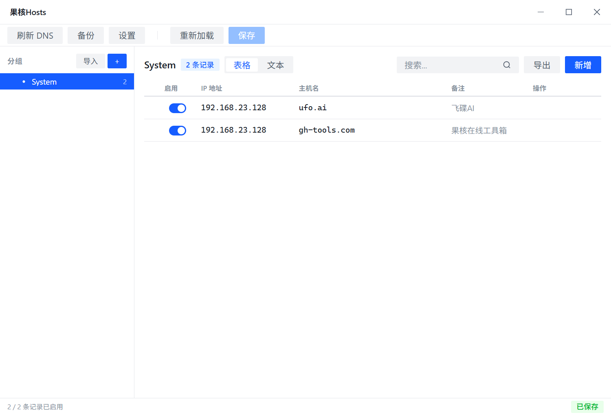
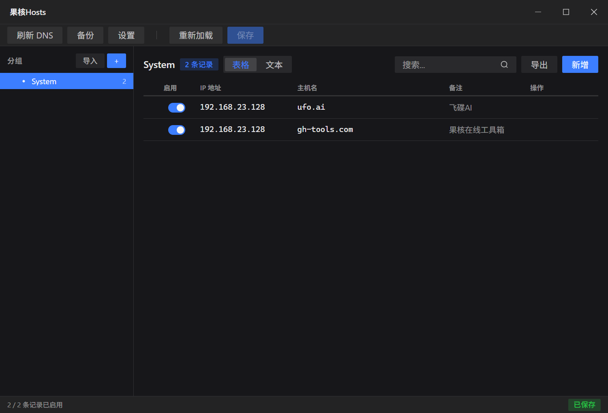

# Guohe Hosts

A modern Windows hosts file manager built with Tauri 2, Vue 3, and Rust.

Manage multiple host groups, switch between them with one click, and keep your system hosts file clean.

## Features

- **Group Management** — Organize hosts entries into named groups, stored as individual `.hosts` files
- **Single-Select Activation** — Radio-button style: activate one group at a time, instantly applied to system hosts
- **Startup Sync** — On launch, compares system hosts with local copy; external edits are preserved
- **Table & Text Editing** — Switch between a structured table view and a CodeMirror text editor per group
- **Drag & Drop Sorting** — Reorder groups and entries via drag handles
- **Search & Highlight** — Filter entries with keyword highlighting
- **Backup & Restore** — Create timestamped backups of the system hosts file, restore with one click
- **Import / Export** — Paste hosts text to import, copy to export
- **DNS Flush** — One-click `ipconfig /flushdns` with toast notification
- **System Tray** — Minimize to tray; right-click menu for quick actions
- **Dark Mode** — Light / Dark / System theme, powered by Arco Design
- **i18n** — Chinese (zh-CN) and English (en-US)
- **Portable** — Config and group data stored next to the executable (`config.json`, `data/`)

## Screenshots

| Light Mode | Dark Mode |
|-----------|----------|
|  |  |

## Tech Stack

| Layer | Technology |
|-------|-----------|
| Framework | [Tauri 2.x](https://v2.tauri.app/) |
| Backend | Rust |
| Frontend | Vue 3 + TypeScript + Vite |
| UI | [Arco Design Vue](https://arco.design/vue) |
| State | Pinia 3 |
| Editor | CodeMirror 6 |
| Drag & Drop | vue-draggable-plus |
| Package Manager | bun |

## Prerequisites

- [Rust](https://rustup.rs/) >= 1.77
- [Node.js](https://nodejs.org/) >= 18
- [bun](https://bun.sh/) >= 1.0
- Windows 10/11 (the app requires administrator privileges to write the hosts file)

## Build

```bash
# Install frontend dependencies
bun install

# Development (launches Tauri dev window)
bun run tauri dev

# Production build (outputs installer to src-tauri/target/release/bundle/)
bun run tauri build
```

> **Note:** `bun run tauri dev` requires running in an elevated (administrator) terminal, because the app writes to `C:\Windows\System32\drivers\etc\hosts`.

## Project Structure

```
├── src/                        # Vue 3 frontend
│   ├── components/             # UI components
│   │   └── layout/             # AppHeader, AppToolbar, AppSidebar, AppStatusBar
│   ├── stores/                 # Pinia stores (hosts, config)
│   ├── composables/            # useHosts composable
│   ├── types/                  # TypeScript interfaces
│   └── i18n/                   # zh-CN, en-US translations
├── src-tauri/                  # Rust backend
│   └── src/
│       ├── commands/hosts.rs   # Tauri IPC commands
│       ├── models/host.rs      # Data structures
│       ├── parser/             # Hosts file parser & serializer
│       └── services/           # File I/O, config, group storage
├── package.json
├── vite.config.ts
└── src-tauri/tauri.conf.json
```

## How It Works

1. **Group Storage** — Each group is a separate `.hosts` file under `{exe_dir}/data/`, with metadata in `manifest.json`.
2. **Single-Select** — Only one group is active at a time. Activating a group writes its entries to the system hosts file and flushes DNS.
3. **System Hosts** — The generated hosts file is clean (no markers), just standard `IP hostname` lines with a header comment.
4. **Startup Check** — On launch, the app compares the system hosts file with the active group's local copy. If they differ (e.g. someone edited hosts manually), the system version takes priority.

## License

[MIT](LICENSE)
